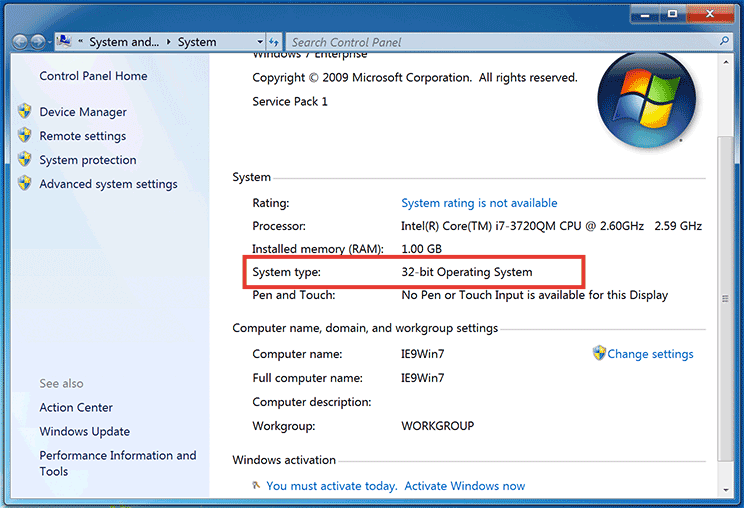

# [Ruby] Windows にインストール

## OS が 32bit / 64bit のどちらで動作しているか確認

- [8.1/10] windows > システム
- [8.0] (キーボード操作) Windows + X > システム
- [7.x] windows > コンピュータ > プロパティ



公式サイトより任意のバージョンをダウンロードしてインストール
- http://rubyinstaller.org/
- https://rubyinstaller.org/downloads/ （ダウンロードページ）

ダウンロードしたインストーラを起動して Ruby をインストールします。
この時、必ず「□ Ruby の実行ファイルへの環境変数パスを設定する」にチェックを入れてください


Ruby のインストールが完了しているか確認
```
> ruby -v
ruby 2.2.2p95 (2015-04-13 revision 50295) [i386-mingw32]
```

文字コードを UTF-8 に変更
```
> set LANG=ja_JP.UTF-8
```

RubyGems をアップデート（若干時間がかかる場合があります）
```
> gem update —system
```